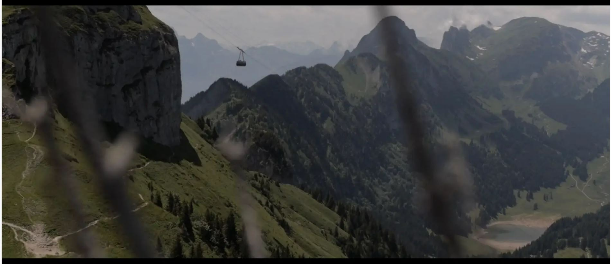
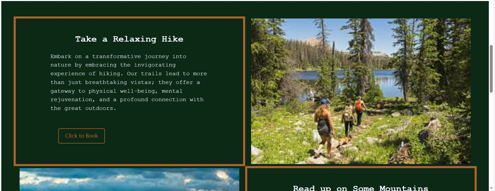
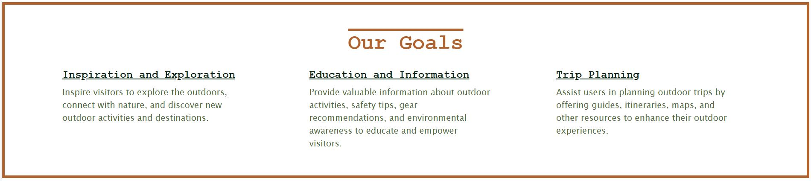
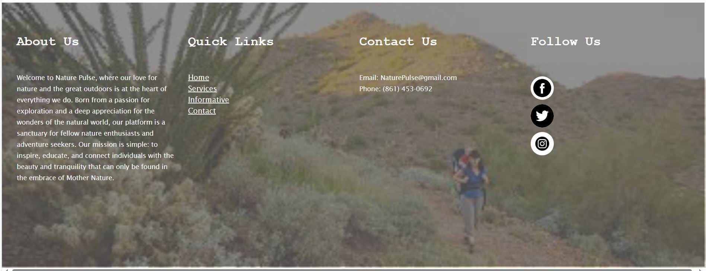
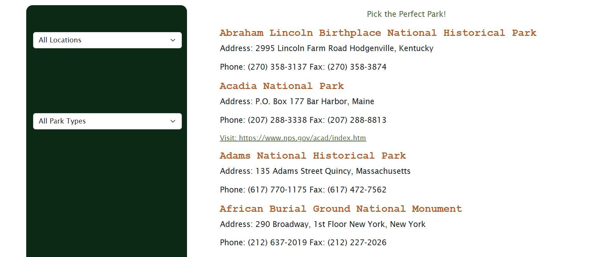
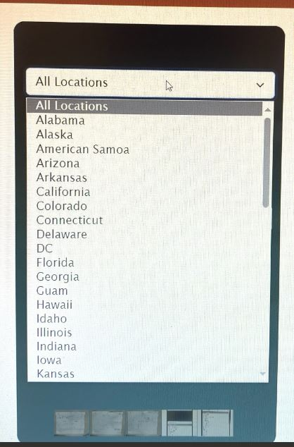
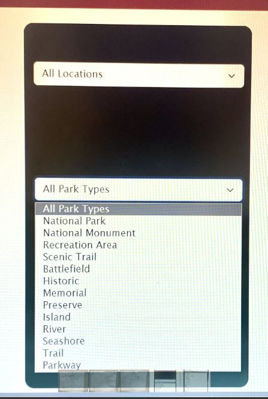

# Enjoy the Outdoors Website

A basic website, consisting of three simple pages, made with HTML, CSS, Bootstrap, and a large focus on JavaScript.

## Home Page

---

The home page starts with a nav bar at the top.

_Navigation bar spans across **ALL** pages and highlights the current page the user is on._

Next is a video that displays a walk/hike through a nature trail.

_It functions the same as any other video._

The middle of the page gives insight on what's to come on the next pages 

_There is a section for the national parks page **AND** the mountains page._

Each section includes a button that links to the corresponding page

For additional information there is a goal section

Lastly there is a footer section that contains basic information about the website

## National Parks Page

---

The next page contains national parks of different types from different states

The page consists of two filters, state and type, that can be used simultaneously or not at all

_The selectors/filters are on the left and the corresponding parks are displayed on the right._

_You **CAN** filter by **ONLY** the state._

_You **CAN ALSO** filter by **ONLY** the park type._

## Mountains Page

---

Next is the registration page that allows new users to create an account.

For added visual appeal there is a carousel containing three images.

