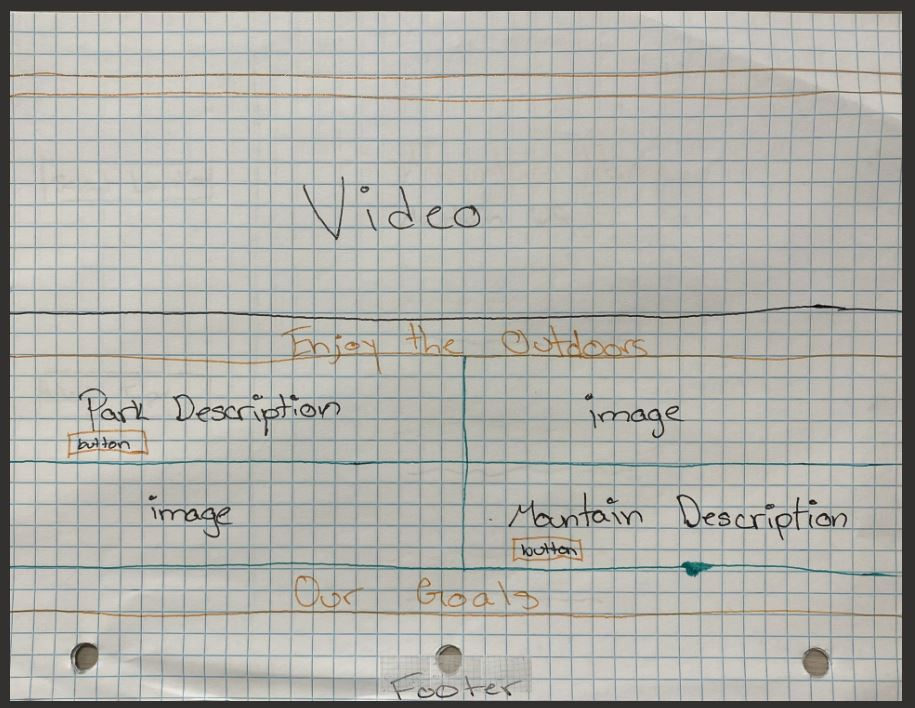
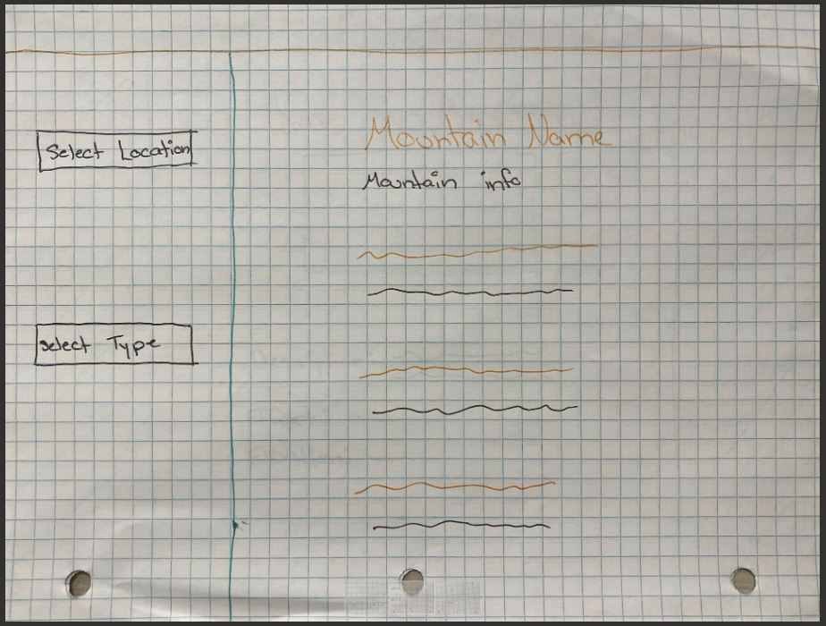
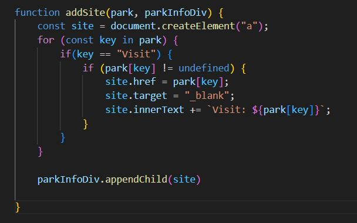
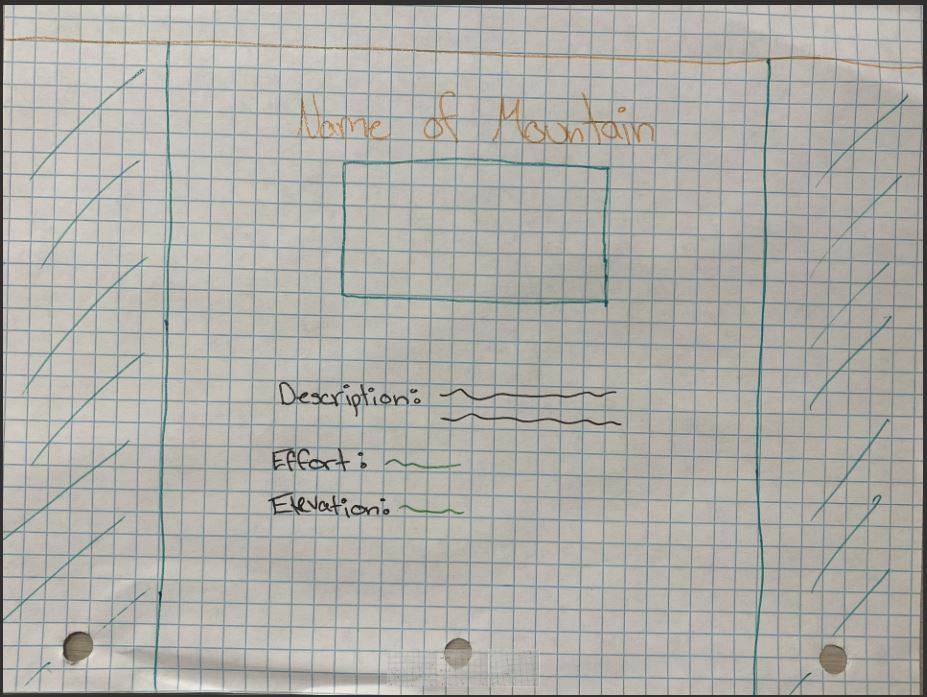
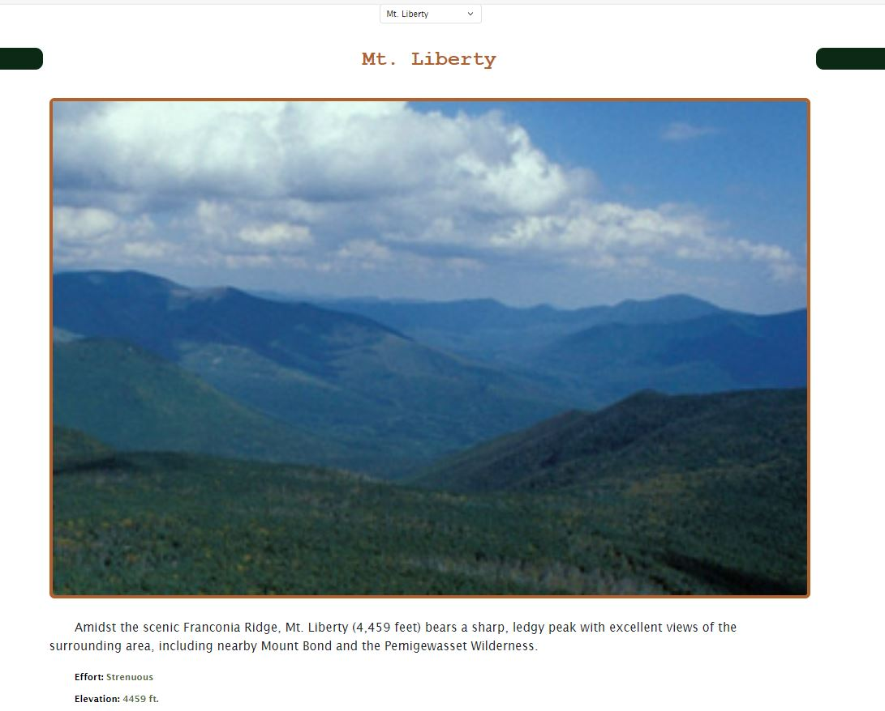

# Enjoy the Outdoors Website

A basic website, consisting of three simple pages, made with HTML, CSS, Bootstrap, and a large focus on JavaScript.

## Home Page

---

_The layout plan for the home page_

The home page starts with a nav bar at the top.

_Navigation bar spans across **ALL** pages and highlights the current page the user is on._

Next is a video that displays a walk/hike through a nature trail.

_It functions the same as any other video._

The middle of the page gives insight on what's to come on the next pages 

_There is a section for the national parks page **AND** the mountains page._

Each section includes a button that links to the corresponding page

For additional information there is a goal section

Lastly there is a footer section that contains basic information about the website

## National Parks Page

---

_The layout plan for the national park page_

The next page contains national parks of different types from different states

The page consists of two filters, state and type, that can be used simultaneously or not at all

_The selectors/filters are on the left and the corresponding parks are displayed on the right._

_You **CAN** filter by **ONLY** the state._

_You **CAN ALSO** filter by **ONLY** the park type._

Adding the different detials was for each park was a challenge in and of itself, however adding the site aspect was very interesting.
Every park did not have a website link so I needed to filter through both an array and object, using the key, to see if there was a website.
If it did then it would be added on to the corresponding park section.

## Mountains Page

---

_The layout plan for the mountains page_

Last is the mountains page that contains different information about the selected mountain

For added visual appeal there is a carousel with added text

_There are three images_

The page includes a selector for different mountains

_Users can choose by name_

The information for the chosen mountain is dipalyed under
